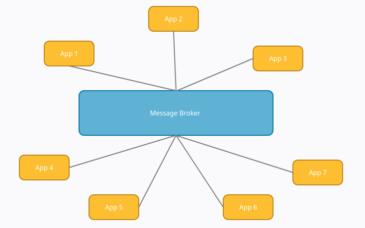
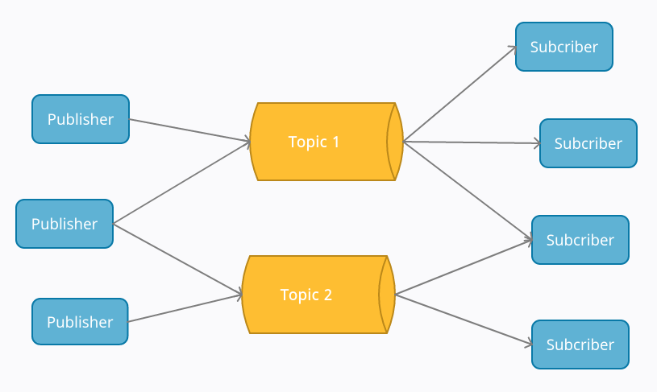
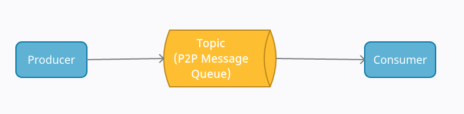

# Eventflow - A Message Broker System

Eventflow is an experimental message broker system, developed to understand the working of a message broker. In essence, Eventflow captures the basic features of enterprise event stream processing softwares like [Apache Kafka](https://kafka.apache.org/) or [RabbitMQ](https://www.rabbitmq.com/). Eventflow is also similar to the jobs queue use case of [Redis](https://redis.io/). This system is developed purely for learning purposes and not suitable for production. Go through this README to learn more about message brokers and its use cases. Instructions to setup Eventflow in your own device, and implementation details of Eventflow's API are also provided. 

Contents:

- [What is a message broker?](#messagebroker)
- [Features](#features)
- [Eventflow API](#api)
- [Setup](#setup)
- [Limitations](#limitations)
- [Developers](#dev)
- [References](#references)

## <a name="messagebroker"></a>What is a message broker?

A message broker is a system that facilitates the communication between different applications, services and system. In a production environment, message brokers effectively translate messages between formal messaging protocols. It hence allows for easy flow of data between applications and services, even if they're written in different languages and follow different protocols.

For a brief introduction on message brokers, check out [this video](https://www.youtube.com/watch?v=wA259esVY4A).

#### Why is it needed?

In complex applications where several services are running interdependent to each other, each service must be connected with every other service. Without a message broker middleware, the connections essentially form a K-complete graph, where each vertex represents a service. 

&nbsp;&nbsp;&nbsp;&nbsp;&nbsp;&nbsp;&nbsp;&nbsp;&nbsp;&nbsp;&nbsp;&nbsp;&nbsp;&nbsp;&nbsp;&nbsp;&nbsp;&nbsp;&nbsp;&nbsp;&nbsp;&nbsp;&nbsp;&nbsp;&nbsp;&nbsp;&nbsp;&nbsp;&nbsp;&nbsp;&nbsp;&nbsp;&nbsp;&nbsp;&nbsp;&nbsp;&nbsp;&nbsp;&nbsp;&nbsp;&nbsp;&nbsp;&nbsp;&nbsp;&nbsp;&nbsp;&nbsp;&nbsp;&nbsp;&nbsp;

As we can see, the number of connections quickly increases with increase in number of services. Forming these connections seperately is a costly and complicated operation. That's where a message broker comes into the picture. Instead of connecting all the interdependent applications to each other, they're connected to a message broker. This acts as a point of communication. Services can send messages to a the message broker. These messages stay there until a receiving application is ready to fetch them. Now all applications are just connected to the message broker, they do not need to know the destination to send messages. 

&nbsp;&nbsp;&nbsp;&nbsp;&nbsp;&nbsp;&nbsp;&nbsp;&nbsp;&nbsp;&nbsp;&nbsp;&nbsp;&nbsp;&nbsp;&nbsp;&nbsp;&nbsp;&nbsp;&nbsp;&nbsp;&nbsp;&nbsp;&nbsp;&nbsp;&nbsp;&nbsp;&nbsp;&nbsp;&nbsp;&nbsp;&nbsp;&nbsp;&nbsp;&nbsp;&nbsp;&nbsp;&nbsp;&nbsp;&nbsp;&nbsp;&nbsp;&nbsp;&nbsp;&nbsp;&nbsp;&nbsp;&nbsp;&nbsp;&nbsp;

The two basic messaging styles of a message broker system are:

1. Point-to-point messaging
2. Publish/Subscribe messaging

Further information about these distribution patterns is provided in [Features](#features).

## <a name="features"></a>Features

Eventflow offers implementation of the two message distribution patterns, point-to-point messaging and publish/subscribe messaging. Additionally, status logging is also provided.

1. <b>Publish/Subscribe messaging - </b>This pattern, often referred to as pub/sub is used for broadcast style communication. The producer of a message publishes it to a topic. A consumer subscribes to a topic to receive its messages. All applications subcribed to this topic will receive all the messages published on to it. This establishes a one-to-many relationship between the producer and consumers of message. For example, in the case of change in route of a train, this information may be useful to several entities, the staff positioned at railway stations concerned by the update, the locomotive pilot and the staff onboard the train, and the passengers. In this case, pub/sub model should be used.

&nbsp;&nbsp;&nbsp;&nbsp;&nbsp;&nbsp;&nbsp;&nbsp;&nbsp;&nbsp;&nbsp;&nbsp;&nbsp;&nbsp;&nbsp;&nbsp;&nbsp;&nbsp;&nbsp;&nbsp;&nbsp;&nbsp;&nbsp;&nbsp;&nbsp;&nbsp;&nbsp;&nbsp;&nbsp;&nbsp;&nbsp;&nbsp;&nbsp;&nbsp;&nbsp;&nbsp;&nbsp;&nbsp;&nbsp;&nbsp;&nbsp;&nbsp;&nbsp;&nbsp;&nbsp;&nbsp;&nbsp;&nbsp;&nbsp;&nbsp;

&nbsp;&nbsp;&nbsp; Note that a publisher can also subscribe to topics and vice versa. 

2. <b>Point-to-Point messaging - </b>This pattern is used when there is a one-to-one relationship between producer and consumer. Only one producer will send messages to a message queue. These messages will be fetched by only one consumer, and only once. This pattern is useful in financial transactions, where a payment should be carried out exactly once. 

&nbsp;&nbsp;&nbsp;&nbsp;&nbsp;&nbsp;&nbsp;&nbsp;&nbsp;&nbsp;&nbsp;&nbsp;&nbsp;&nbsp;&nbsp;&nbsp;&nbsp;&nbsp;&nbsp;&nbsp;&nbsp;&nbsp;&nbsp;&nbsp;&nbsp;&nbsp;&nbsp;&nbsp;&nbsp;&nbsp;&nbsp;&nbsp;&nbsp;&nbsp;&nbsp;&nbsp;&nbsp;&nbsp;&nbsp;&nbsp;&nbsp;&nbsp;&nbsp;&nbsp;&nbsp;&nbsp;&nbsp;&nbsp;&nbsp;&nbsp;

3. <b>Activity logging - </b>The status log of any activity that occurs after connection with Eventflow is established is logged in a separate topic defined for logging. The log includes details about the activity and the time it occured. Steps to define a topic for status log are listed in [Setup](#setup). 

Eventflow API contains publish and subscribe for achieving publish/subscribe messaging. Additionally, client authentication and authorization features are provided for point-to-point messaging. However, acks have not been implemented i.e. a producer will never know if a message is delivered. This bears a serious limitation in message communication. More on this in [Eventflow API](#api).

## <a name="api"></a>Eventflow API
The system exposes four REST API endpoints.These endpoints will be used by the clients to communicate with eventflow. Eventflow supports only HTTPS. It expects the request data to be JSON. A sentence ending in * describes current behavior that is subject to change in the future.

### 1. POST /auth:
This endpoint authenticates the clients and returns a token. All the other endpoints expect this token. The token is a JWToken*. The request data and the response messages are shown below.
```
request-data:
    "name" - Client name.
    "password" - Client password.
    "notify_on" - Notification port no.
response-data:
    if authenticated: (200)
        "token" - Token.
    else: (400: Bad Request - Authorization Data Invalid,
           400: Bad Request - Missing Required Information,
           500: Internal Server Error)
        "error" - States the error.
```
Client authentication information is stored on a file on the server machine. Adding new clients is discussed along in the Setup section. The clients also need to specify a port number where they listen for notifications sent out by eventflow.

### 2. POST /publish:
This endpoint publishes an event to the specified topic. When a new event is published on a topic, each of the topic’s subscribers are notified on the port that they mentioned during authentication. There is, currently, no way for a publisher to know that the event was read by all the subscribers. Also, the event can only be read by the subscribers active at the time of event publication. Publishers can only publish one event at a time*. The request data and the response messages are shown below.
```
request-data:
    "token" - Token.
    "topic" - Topic.
    "event" - Event / Message.
response-data:
    if authorized: (201: Created - Event Published Successfully)
        "status" - States the status.
    else: (403: Forbidden - Client Not A Publisher Of Topic,
           400: Bad Request - Empty Topic / Event Information,
           404: Not Found - Topic Does Not Exist,
           409: Conflict - No Such Active Client,
           401: Unauthenticated - Invalid Token Supplied,
           400: Bad Request - Missing Required Information,
           500: Internal Server Error)
        "error" - States the error.
```

Configuration files contain information about which client can publish events on which topics. This information is used to authorize the actions performed by the client.

### 3. GET /:
This endpoint fetches an event from the specified topic. An event can be fetched only once and only the subscribers of the topic that were active at the time of publication*. The response only contains a single event from a single topic*. The request data and the response messages are shown below.
```
request-data:
    "token" - Token.
    "topic" - Topic.
response-data:
    if authorized:
        if no events: (204: No Content - No New Events)
            "status" - States the status.
        else: (200)
            "event" - Event.
    else: (403: Forbidden - Client Not A Subscriber Of Topic,
           400: Bad Request - Empty Topic Information,
           404: Not Found - Topic Does Not Exist,
           409: Conflict - No Such Active Client,
           401: Unauthenticated - Invalid Token Supplied,
           400: Bad Request - Missing Required Information,
           500: Internal Server Error)
        "error" - States the error.
```

Configuration files contain information about which client can fetch events from which topics. This information is used to authorize the actions performed by the client.

### 4. POST /disconnect:
This endpoint disconnects a client or sets the client as inactive. Once a client is disconnected, they cannot use the token to make requests. If they do so, then eventflow will send a 409 Conflict response. The request data and the response messages are shown below.
```
request-data:
    "token" - Token.
response-data:
    if authorized: (200: OK - Disconnected Successfully)
        "status" - States the status.
    else: (409: Conflict - No Such Active Client,
           401: Unauthenticated - Invalid Token Supplied,
           400: Bad Request - Missing Required Information,
           500: Internal Server Error)
        "error" - States the error.
```
## <a name="setup"></a>Setup
This section discusses building, configuring and using Eventflow.
### <b>1. Building Eventflow:</b>

```
# Resolve Dependencies.
# Press 'y' when prompted for installation.
./dependency_mgmt.sh

# Run again to be sure.
# If you see the message "You're good to go!!!",
# then you can go ahead with the build.
./dependency_mgmt.sh

# For debug build
make debug

# For release build
make
```


Make will create a bin directory that would contain all the object and executable files. There will be two executables. One is eventflow and the other is eventflowctl. eventflow is used to run the server. eventflowctl is used to add, modify and remove clients.

### 2. Configuring Eventflow:
Configuration in Eventflow is done in yaml. Some of the configuration information can also be passed as command line arguments. The configuration provided in command line arguments take precedence over those provided in the config file. The following is a complete list of configuration options.


#### Config file location:
By default, the eventflow executable expects a config.yaml file in the current directory to contain the configuration information. But the config file can be placed elsewhere and the path to the config file can be provided as a command line argument.
<br><b>Eg:</b> `eventflow --config ~/.config/eventflow/config.yaml`
#### Authentication Information file location:
By default, the eventflow executable expects a clientinfo file in the current directory to contain the client authentication information. But the authentication information file can be placed elsewhere and the path to the config file can be provided as a command line argument.
<br><b>Eg:</b> `eventflow --authinfo ~/.config/eventflow/clientinfo`
#### Port Number:
By default, the eventflow executable will expose the REST API on 18080 port number. But this can be changed by providing the value in the config file or as a command line argument.
<br><b>Eg:</b> `eventflow --port 38080`
#### Number of REST API Threads:
By default, the eventflow executable will create as many threads for the REST API as supported by the hardware. This is the same as the response of the call to the function `std::thread::hardware_concurrency()`. But this can be changed by providing the value in the config file or as a command line argument. If the given value is zero, then the system will have default behavior.
<br><b>Eg:</b> `eventflow --threads 8`
#### .crt and .key file location:
By default, the eventflow executable expects a host.crt and a host.key file in the current directory. These two files are the certificates used by HTTPS to secure the connection between client and server. If these files are placed elsewhere, then their location can be provided in the config file or as command line arguments.
<br><b>Eg:</b> `eventflow --crt ~/.config/crts/eventflow.crt --key ~/.config/keys/eventflow.key`
#### Topics:
This is used to provide a list of all the topics that the server should host along with a list of their subscribers and publishers. The system does not check if the publisher / subscriber list contains only those clients that are also present in the authinfo file. Any publisher / subscriber in the list who is not in the authinfo file, will never be able to publish / fetch events from the topic as they will never be able to authenticate themselves.
#### JWT secret key:
This key is used to sign the JWT. This key should not be shared with any other server as the tokens and the claims are only useful to the eventflow server and the claims should not be changed. This value is mandatory and must be present in the configuration file.
#### JWT validity:
By default, the tokens are valid for 24 hours. But this can be changed by providing the value (in hours)  in the config file.
#### Status Logging Topic name:
This configuration serves two purposes. If the value for this configuration is present and non-empty, then status logging will be enabled on the topic specified. This topic will be used by eventflow to log client requests. So this topic must have no other publishers. But the system, currently, does not check if the publisher list is empty*. This is a serious problem as every external publish to the topic would cause one event (log) to be written to the topic as well.
#### Logger Thread count:
By default, the logger thread count is 1. But this can be changed by providing the value in the config file.
#### Logger Queue size:
By default, the logger queue size is 8192. But this can be changed by providing the value in the config file.

For all of the configuration options that can be provided in the configuration file as well as command line arguments, the value provided as command line arguments would take precedence over the one provided in the config file.

### <b>Demo config.yaml file:</b>
```
port: 38080
threads: 10
crt: example.crt
key: example.key
jwt_secret: Hello
status_log_topic: status_log
topics:
    - name: topic1
      publishers: [client1, client3]
      subscribers: [client2, client4]
    - name: topic2
      publishers: [client2, client4]
      subscribers: [client1, client3]
    - name: status_log
      publishers: []
      subscribers: [client1, client2, client4]
```

### 3. Using Eventflow:
Using eventflow involves writing the configuration files, creating the authentication info file and executing the eventflow executable. The configuration file format is yaml. All the various options were discussed in the previous section. Now to create the authentication info file, we use the eventflowctl executable. This executable can also be used to modify an existing authentication info file.
The eventflowctl executable has 3 main options:
#### Authentication Info file location:
By default, the eventflowctl executable looks for a clientinfo file in the current directory. But this can be changed by providing the path to an existing file or your preferred location as command line argument.
<br><b>Eg:</b> `eventflowctl -f ~/.config/eventflow/passwd -a add`
#### Action:
This is a mandatory argument. This specifies the action you want to perform. This includes add, mod and del to add a new client, modify an existing client’s password and to delete a client, respectively. add and mod actions prompt you for a new password.
<br><b>Eg:</b> `eventflowctl -a mod`
#### Client name:
The client name can be provided as a command line argument. However, if the client name is not specified, then you will be prompted to enter the client name.
<br><b>Eg:</b> `eventflowctl -a del -n Client1`

### <b>Demo usage of eventflowctl:</b>
```
> eventflowctl -a add -n Client1
Password:
Confirm Password:
> cat clientinfo
Client1 : $1$mxWGU96.$EJYW2crsKEPqatyPcNrYG1
> eventflowctl -a add
Client Name: Client2
Password:
Confirm Password:
> cat clientinfo
Client2 : $1$myWGUT6.$YNYI0gTe15iq5g/CATVYp/
Client1 : $1$mxWGU96.$EJYW2crsKEPqatyPcNrYG1
> eventflowctl -a mod
Client Name: Client3
Client with name 'Client3' does not exist.
> eventflowctl -a mod -n Client1
Password:
Confirm Password:
> cat clientinfo
Client1 : $1$j/XGUF7.$GrX2qqKXz/M4om19/HjLc0
Client2 : $1$myWGUT6.$YNYI0gTe15iq5g/CATVYp/
> eventflowctl -a del -n Client2
> cat clientinfo
Client1 : $1$j/XGUF7.$GrX2qqKXz/M4om19/HjLc0
> eventflowctl -a del
Client Name: Client1
> cat clientinfo
```

Now, we can execute eventflow providing any of the described command line arguments we want to provide.
```
eventflow --port 38080 --threads 8  --config ~/.config/eventflow/config.yaml --authinfo ~/.config/eventflow/clientinfo --crt ~/.config/crts/eventflow.crt --key ~/.config/keys/eventflow.key
```

## <a name="limitations"></a>Limitations

* The publishers currently can only send a single event for a single topic on one request. Future extensions could allow publishers to publish multiple events over multiple topics on one request. The same can also be done for subscribers so that they can fetch multiple events from multiple topics.
* The system does not check if the publisher list is empty for the topic used for status logging. Every publish request by a client for that topic will cause two (if succeeds; one, if fails) events to be published to the topic with the additional event generated by the system.
* The system is centralized and the events are not persisted. If the server fails or the hardware crashes, the server won’t be able to regain state. This is a serious limitation and will introduce a single point of failure in a system using this server. It is important to bring persistence / redundancy into the system to prevent this. One way would be to adopt a decentralized architecture wherein multiple instances host the topics and the events on the topics are duplicated. So if one instance fails, the other can continue serving the clients.
* There are no client libraries for automating the authentication, publish, fetch and disconnect actions. This is a limitation to the adoption of the system and client libraries need to be developed as part of future iterations. To support multiple instances of the same client, the token has to be shared. This requires a central controller that would authenticate the client, acquire the token, share it with all the instances and disconnect from the server when all of them want to disconnect. Another way would be to create unique ids for each client instance and store it in the token, so that all the clients can manage their connections individually.
* Currently, JSON is the medium of exchange of data. This is because JSON is much faster and easier to write and debug and is less verbose than XML. JSON serializers and deserializers are also present for almost all the languages. However, different clients want data in different formats. This can be achieved by allowing the usage of plugins. Users can then write plugins that translate the data into a given format.
* Configuration can be hard. A small web client can be created providing a GUI for creating a configuration file.
* ACKs have not been implemented i.e. a producer will never know if a message has been received by all or any of the subscribers. This bears a serious limitation in message communication.

## <a name="dev"></a>Developers
[Vishal Dalwadi](https://github.com/VishalDalwadi) | [Khadija Sidhpuri](https://github.com/squarebat)
------------- | -------------

## <a name="references"></a>References

[IBM - Message Brokers](https://www.ibm.com/cloud/learn/message-brokers) - For detailed information on message brokers.

[Making Sense of Stream Processing](https://assets.confluent.io/m/2a60fabedb2dfbb1/original/20190307-EB-Making_Sense_of_Stream_Processing_Confluent.pdf) - An excellent book by Martin Kleppmann about the philosophy behind Scalable Stream Data Platforms.

---
## NOTE
**<i>crow_all.h</i>** file in the repo is the output of the build of the [crow](https://github.com/ipkn/crow) project. However, some modifications had to be made to this file which is why we have the file in our repo. Here is the LICENSE of the crow project.
```
Copyright (c) 2014, ipkn
All rights reserved.

Redistribution and use in source and binary forms, with or without
modification, are permitted provided that the following conditions are met:

* Redistributions of source code must retain the above copyright notice, this
  list of conditions and the following disclaimer.

* Redistributions in binary form must reproduce the above copyright notice,
  this list of conditions and the following disclaimer in the documentation
  and/or other materials provided with the distribution.

* Neither the name of the author nor the names of its
  contributors may be used to endorse or promote products derived from
  this software without specific prior written permission.

THIS SOFTWARE IS PROVIDED BY THE COPYRIGHT HOLDERS AND CONTRIBUTORS "AS IS"
AND ANY EXPRESS OR IMPLIED WARRANTIES, INCLUDING, BUT NOT LIMITED TO, THE
IMPLIED WARRANTIES OF MERCHANTABILITY AND FITNESS FOR A PARTICULAR PURPOSE ARE
DISCLAIMED. IN NO EVENT SHALL THE COPYRIGHT HOLDER OR CONTRIBUTORS BE LIABLE
FOR ANY DIRECT, INDIRECT, INCIDENTAL, SPECIAL, EXEMPLARY, OR CONSEQUENTIAL
DAMAGES (INCLUDING, BUT NOT LIMITED TO, PROCUREMENT OF SUBSTITUTE GOODS OR
SERVICES; LOSS OF USE, DATA, OR PROFITS; OR BUSINESS INTERRUPTION) HOWEVER
CAUSED AND ON ANY THEORY OF LIABILITY, WHETHER IN CONTRACT, STRICT LIABILITY,
OR TORT (INCLUDING NEGLIGENCE OR OTHERWISE) ARISING IN ANY WAY OUT OF THE USE
OF THIS SOFTWARE, EVEN IF ADVISED OF THE POSSIBILITY OF SUCH DAMAGE.
```
