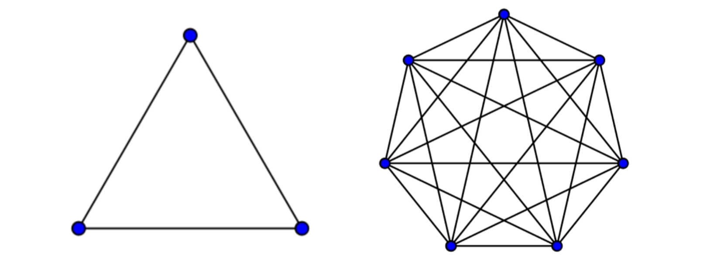

# Eventflow - A Message Broker System

Eventflow is an experimental message broker system, developed to understand the working of a message broker. In essence, Eventflow captures the basic features of enterprise event stream processing softwares like Apache Kafka or RabbitMQ. Eventflow is also similar to the jobs queue use case of Redis. This system is developed purely for learning purposes and not suitable for production. Go through this README to learn more about message brokers and its use cases. Instructions to setup Eventflow in your own device, and implementation details of Eventflow's API are also provided. 

## What is a message broker?

A message broker is a system that facilitates the communication between different applications, services and system. In a production environment, message brokers effectively translate messages between formal messaging protocols. It hence allows for easy flow of data between applications and services, even if they're written in different languages and follow different protocols.

For a brief introduction on message brokers, check out [this video](https://www.youtube.com/watch?v=wA259esVY4A).

#### Why is it needed?

In complex applications where several services are running interdependent to each other, each service must be connected with every other service. Without a message broker middleware, the connections essentially form a K-complete graph, where each vertex represents a service. 

As we can see, the number of connections quickly increases with increase in number of services. Forming these connections seperately is a costly and complicated operation. That's where a message broker comes into the picture. Instead of connecting all the interdependent applications to each other, they're connected to a message broker. This acts as a point of communication. Services can send messages to a the message broker. These messages stay there until a receiving application is ready to fetch them. Now all applications are just connected to the message broker, they do not need to know the destination to send messages. 

The two basic messaging styles of a message broker system are:

1. Point-to-point messaging
2. Publish/Subscribe messaging

Further information about these distribution patterns is provided in [Features](#Features).

## Use Cases
## Features
## Setup
## Eventflow API
## Limitations
## Developers
## References

[IBM - Message Brokers](https://www.ibm.com/cloud/learn/message-brokers) - For detailed information on message brokers.

[Making Sense of Stream Processing](https://assets.confluent.io/m/2a60fabedb2dfbb1/original/20190307-EB-Making_Sense_of_Stream_Processing_Confluent.pdf) - An excellent book by Martin Kleppmann about the philosophy behind Scalable Stream Data Platforms.
